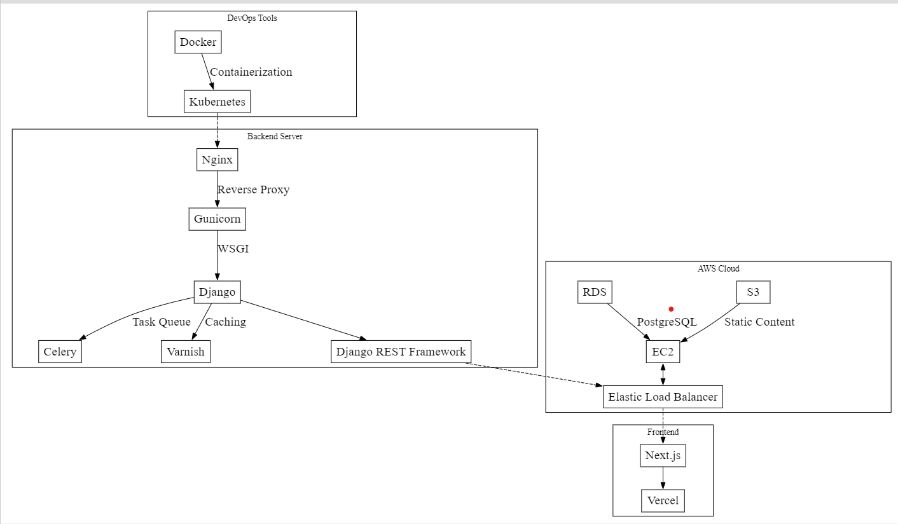
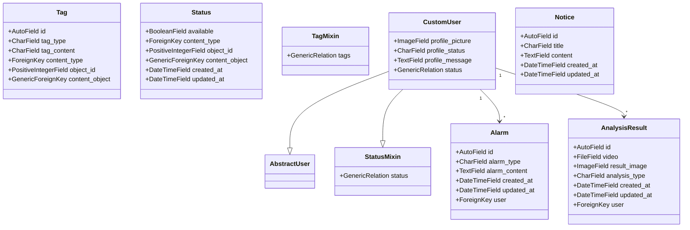

## 목차

- [Safe Eye - 스마트안전 경고 알람 서비스](#safe-eye---스마트안전-경고-알람-서비스)
  - [기능(되면 체크 표시)](#기능되면-체크-표시)
  - [기술 스택(예상)](#기술-스택예상)
  - [라이선스](#라이선스)
  - [시스템 요구사항](#시스템-요구사항)
  - [팀 멤버 소개](#팀-멤버-소개)
  - [아키텍쳐 예시](#아키텍쳐-예시)
  - [설치 및 실행](#설치-및-실행)
  - [commands script file](#commands-script-file)
  - [기타 커맨드](#기타-커맨드)
  - [Mock Data](#mock-data)
  - [폴더 구조](#폴더-구조)
  - [앱 설명](#앱-설명)
- [Safe Eye 프로젝트 ERD](#safe-eye-프로젝트-erd)
  - [1. 모델 설명](#1-모델-설명)
    - [1.1 utils 앱](#11-utils-앱)
      - [1.1.1 Tag 모델](#111-tag-모델)
      - [1.1.2 Status 모델](#112-status-모델)
      - [1.1.3 TagMixin 모델](#113-tagmixin-모델)
      - [1.1.4 StatusMixin 모델](#114-statusmixin-모델)
    - [1.2 accounts 앱](#12-accounts-앱)
      - [1.2.1 CustomUser 모델](#121-customuser-모델)
    - [1.3 notice 앱](#13-notice-앱)
      - [1.3.1 Notice 모델](#131-notice-모델)
    - [1.4 alarm 앱 (추가 필요)](#14-alarm-앱-추가-필요)
      - [1.4.1 Alarm 모델](#141-alarm-모델)
    - [1.5 ai 앱 (추가 필요)](#15-ai-앱-추가-필요)
      - [1.5.1 AnalysisResult 모델](#151-analysisresult-모델)
  - [2. ERD](#2-erd)
  - [Notice 앱](#notice-앱)
  - [푸터](#푸터)

# Safe Eye - 스마트안전 경고 알람 서비스

Safe Eye는 CCTV 카메라와 AI 기술을 활용하여 공간 안전을 강화하고자 만든 프로젝트입니다. 컴퓨터 비전 및 인공지능 기술을 활용하여 CCTV 영상을 분석하고, 잠재적인 위험 상황을 신속하게 감지하여 대응할 수 있도록 안전 관리자를 지원합니다.

## 기능(되면 체크 표시)

1. **실시간 이상 행동 감지**

   - CCTV 영상에서 사람들의 행동을 실시간으로 분석하여 이상 행동을 감지합니다.
   - 폭력, 절도, 기물 파손 등 다양한 유형의 이상 행동을 인식할 수 있습니다.
   - 이상 행동 발생 시 즉각적인 알람을 발송하여 신속한 대응을 촉진합니다.

2. **상세 분석 화면**

   - 선택한 카메라 또는 영역의 고해상도 비디오 피드
   - 감지 이벤트 목록 및 상세 정보
   - 사용자 메모 및 설명 추가 기능
   - 비디오 클립, 스크린샷 및 이벤트 데이터 내보내기

3. **경고 및 알람 설정 화면**

   - 경고 및 알람 수준에 따른 특정 작업 설정
   - 생성형 AI 모델을 활용한 맥락 적합 경고 및 알람 메시지 자동 생성
   - 사용자 정의 가능한 알림 메시지 및 수신자 목록
   - 정기적인 테스트 및 훈련 예약 기능

4. **통계 및 보고 화면**

   - 기간 별 이벤트에 대한 상세 보고서 생성
   - 이벤트 데이터 필터링 및 정렬 옵션
   - 통계 데이터, 이벤트 로그 및 보고서 내보내기
   - 자동 보고서 생성 및 전달 예약 기능

5. **사용자 관리 및 설정 화면**
   - 사용자 프로필 정보 업데이트 및 알림 기본 설정
   - 시스템 상태 모니터링 및 진단 도구
   - 각 사용자의 스테이터스에 따라 알람을 분류

## 기술 스택(예상)

- 백엔드: Django, Pillow, DRF, 스웨거, NumPy
- 프론트엔드: Next.js
- 머신러닝: TensorFlow, PyTorch
- 컴퓨터 비전: OpenCV
- 데이터베이스: PostgreSQL
- 실시간 처리: Apache Kafka
- DevOps: Docker, Kubernetes

## 라이선스

SafeEye 프로젝트는 [MIT 라이선스](LICENSE)를 따릅니다.

또한 ai 허브 관련 라이센스 추가 필요.
기업 과제 제공 관련 라이센스 추가 필요.

## 시스템 요구사항

1. 환경 준비:

- 하드웨어 요구 사항: Ubuntu 18.04, 12th Gen Intel(R) Core(TM) i5 CPU, NVIDIA GeForce RTX 3070 GPU
- 소프트웨어 및 모듈 설치:
  Python 3.9과 CUDA 11.6 설치
  필요한 Python 모듈을 requirements.txt을 사용해 설치

2. 모델 정보:
   - LSTM과 MIL Ranking 모델 주로 이상 행동 인식에 사용
   - OpenPose와 UniPose 모델은 자세 추정에 사용

## 팀 멤버 소개

- 이혜림(팀장): 프로젝트의 아키텍처를 설계하고, 기획 단계에서 요구사항을 명확히 정의하며, 프론트엔드 개발을 담당 했습니다.

- 이규성(팀원): AI 모델의 출력값(이미지)을 저장하고 관리하는 미디어 앱을 작성하여 분석 결과를 효과적으로 활용할 수 있도록 했습니다.

- 전지용(팀원): utils 앱 개발을 담당하고 있습니다. 다른 애플리케이션에서 공통적으로 사용할 수 있는 기능을 제공했습니다.

- 정진영(팀원): accounts 앱 개발을 담당하고 있으며, 모델링을 분담하고 있습니다. 사용자 인증과 관련된 기능들(정보 관리, 권한 부여 등)을 구현했습니다.

- 박경민(팀원): alarm 앱 개발을 담당했습니다. 적절한 경고 메시지를 커스텀하고, DB에 저장할 수 있도록 했습니다.

## 아키텍쳐 예시



## 설치 및 실행

1. 프로젝트 저장소 클론:

   ```
   git clone https://github.com/proactive/safe-eye.git
   cd Safe-eye
   ```

2. 필요한 종속성 설치:

   ```
   source ./venv/Scripts/activate
   pip install -r requirements.txt
   ```

   or

   ```
   ./commands.sh
   reinstall
   ```

3. 환경 변수 설정:

   ```
   cp .env.example .env
   # .env 파일을 편집하여 필요한 설정 값 입력
   ```

4. 데이터베이스 마이그레이션 실행:

   ```
   python manage.py migrate
   ```

   or

   ```
   ./commands.sh migrate
   ```

5. Django 서버 실행:

   ```
   python manage.py runserver
   ```

6. Next.js 프론트엔드 프로젝트 레포지토리:

   ```js
   // git clone
   git clone https://github.com/team-proactive/safe-eye-front.git
   cd safe-eye-front

   cp .env.local.example .env.local

   npm install
   npm run dev
   ```

## commands script file

1. `commands.sh` 파일을 실행하여 필요한 작업을 수행할 수 있습니다. 이 파일은 Git Bash에서 실행해야 합니다.

   - 세션 내에서 실행하고 가상환경을 종료하려면 `./commands.sh`를 입력합니다.
   - 세션이 종료되더라도 가상환경을 유지하려면 `. commands.sh`를 입력합니다.

2. 가상 환경을 생성하고 활성화하려면 `reinstall` 커맨드를 실행합니다. 추가로 설치할 패키지를 입력하라는 메시지가 표시되면 필요한 패키지를 입력하거나 엔터를 눌러 건너뛸 수 있습니다.

3. 데이터베이스 마이그레이션을 수행하려면 `migrate` 커맨드를 실행합니다.

4. 프로젝트를 실행하려면 `run` 커맨드를 실행합니다.

## 기타 커맨드

- `install`: 초기 설치를 수행합니다. 가상 환경을 생성하고 Django 프로젝트와 앱을 생성합니다.
- `activate`: 가상 환경을 활성화합니다.
- `migrate`: 데이터베이스 마이그레이션을 수행합니다.
- `run`: Django 개발 서버를 실행합니다.
- `create`: static, media, templates 디렉토리를 생성합니다.
- `static`: static 파일을 수집합니다.
- `reinstall`: 가상 환경을 재설치하고 `requirements.txt`에 명시된 패키지를 설치합니다.
- `remove`: 가상 환경을 제거합니다.
- `add_admin`: 관리자 계정을 생성합니다.
- `mock_data`: 애플리케이션의 초기 데이터를 로드합니다.

## Mock Data

`mock_data` 커맨드를 사용하여 애플리케이션의 초기 데이터를 로드할 수 있습니다. 이 데이터는 각 앱의 `fixtures/initial_data.json` 파일에 정의되어 있습니다.

모델을 변경한 후에는 안전하게 데이터베이스를 삭제하고, AI를 활용하여 해당 모델에 대한 `initial_data.json` 파일을 생성합니다. 그런 다음 `mock_data` 명령어를 사용하여 초기 데이터를 로드합니다.

## 폴더 구조

```
📦safe-eye
 ┣ 📂config
 ┃ ┣ 📜asgi.py
 ┃ ┣ 📜settings.py
 ┃ ┣ 📜urls.py
 ┃ ┗ 📜wsgi.py
 ┣ 📂accounts
 ┃ ┣ 📜admin.py
 ┃ ┣ 📜apps.py
 ┃ ┣ 📜models.py
 ┃ ┣ 📜serializers.py
 ┃ ┣ 📜tests.py
 ┃ ┣ 📜urls.py
 ┃ ┗ 📜views.py
 ┣ 📂alarm
 ┃ ┣ 📂fixtures
 ┃ ┃ ┣ 📜initial_data.json
 ┃ ┃ ┗ 📜mock_data_gen.py
 ┃ ┣ 📜admin.py
 ┃ ┣ 📜apps.py
 ┃ ┣ 📜models.py
 ┃ ┣ 📜serializers.py
 ┃ ┣ 📜tests.py
 ┃ ┣ 📜urls.py
 ┃ ┗ 📜views.py
 ┣ 📂notice
 ┃ ┣ 📂fixtures
 ┃ ┃ ┣ 📜initial_data.json
 ┃ ┃ ┗ 📜mock_data_gen.py
 ┃ ┣ 📜admin.py
 ┃ ┣ 📜apps.py
 ┃ ┣ 📜models.py
 ┃ ┣ 📜serializers.py
 ┃ ┣ 📜tests.py
 ┃ ┣ 📜urls.py
 ┃ ┗ 📜views.py
 ┣ 📂madia
 ┃ ┣ 📂fixtures
 ┃ ┃ ┣ 📜initial_data.json
 ┃ ┃ ┗ 📜mock_data_gen.py
 ┃ ┣ 📜admin.py
 ┃ ┣ 📜apps.py
 ┃ ┣ 📜models.py
 ┃ ┣ 📜serializers.py
 ┃ ┣ 📜tests.py
 ┃ ┣ 📜urls.py
 ┃ ┗ 📜views.py
 ┣ 📂utils
 ┃ ┣ 📂fixtures
 ┃ ┃ ┗ 📜initial_data.json
 ┃ ┣ 📂migrations
 ┃ ┣ 📜admin.py
 ┃ ┣ 📜apps.py
 ┃ ┣ 📜mixins.py
 ┃ ┣ 📜models.py
 ┃ ┣ 📜serializers.py
 ┃ ┣ 📜tests.py
 ┃ ┣ 📜urls.py
 ┃ ┣ 📜views.py
 ┣ 📜.env
 ┣ 📜.env.example
 ┣ 📜.gitignore
 ┣ 📜a-team.png
 ┣ 📜commands.sh
 ┣ 📜manage.py
 ┣ 📜README.md
 ┗ 📜requirements.txt
```

## 앱 설명

1. accounts 앱:

   - 커스텀 유저 모델을 정의하고 관리하는 앱입니다.
   - 사용자 인증, 회원가입, 로그인 등의 기능을 담당합니다.
   - 사용자 정보 관련 API 엔드포인트를 제공합니다.

2. utils 앱:

   - 여러 앱에서 공통적으로 사용되는 유틸리티 모듈을 모아둔 앱입니다.
   - 태그, 상태 등의 상수 값을 정의하고 관리합니다.
   - 믹스인(Mixin) 클래스를 제공하여 코드 재사용성을 높입니다.

3. media 앱:

   - AI 모델의 출력값(이미지)을 저장하고 관리하는 앱입니다.
   - 분석된 이미지 파일을 저장하고 서빙하는 기능을 제공합니다.
   - 이미지 업로드, 다운로드 등의 API 엔드포인트를 제공합니다.

4. alarm 앱:

   - 경고 메시지를 생성하고 관리하는 앱입니다.
   - 이상 행동 감지 시 알람을 발송하는 기능을 담당합니다.
   - 알람 설정, 알람 로그 관리 등의 기능을 제공합니다.

5. notice 앱:

   - 공지사항과 관련된 기능을 담당하는 앱입니다.
   - 시스템 관리자가 사용자에게 공지사항을 전달하는 기능을 제공합니다.
   - 공지사항 목록, 상세 보기, 생성, 수정, 삭제 등의 API 엔드포인트를 제공합니다.

6. ai 앱:
   - AI 모델을 활용하여 영상 분석을 수행하는 앱입니다.
   - CCTV 영상을 실시간으로 분석하고 이상 행동을 감지하는 기능을 담당합니다.
   - AI 모델 추론, 결과 저장, 알람 생성 등의 작업을 수행합니다.

fixtures 디렉토리는 초기 데이터를 로드하기 위한 JSON 파일을 포함합니다.

# Safe Eye 프로젝트 ERD

## 1. 모델 설명

### 1.1 utils 앱

#### 1.1.1 Tag 모델

- id: AutoField, 태그의 고유 식별자
- tag_type: CharField, 태그의 유형
- tag_content: CharField, 태그의 내용
- content_type: ForeignKey, 연결된 모델의 ContentType
- object_id: PositiveIntegerField, 연결된 모델의 객체 id
- content_object: GenericForeignKey, 연결된 모델의 객체

#### 1.1.2 Status 모델

- available: BooleanField, 상태의 유효성 여부
- content_type: ForeignKey, 연결된 모델의 ContentType
- object_id: PositiveIntegerField, 연결된 모델의 객체 id
- content_object: GenericForeignKey, 연결된 모델의 객체
- created_at: DateTimeField, 상태 생성 시간
- updated_at: DateTimeField, 상태 업데이트 시간

#### 1.1.3 TagMixin 모델

- tags: GenericRelation, Tag 모델과의 관계

#### 1.1.4 StatusMixin 모델

- status: GenericRelation, Status 모델과의 관계

### 1.2 accounts 앱

#### 1.2.1 CustomUser 모델

- AbstractUser 모델을 상속받아 구현
- profile_picture: ImageField, 사용자 프로필 사진
- profile_message: TextField, 사용자 프로필 메시지
- profile_status: GenericRelation, StatusMixin을 통해 Status 모델과 관계 (추가)

### 1.3 notice 앱

#### 1.3.1 Notice 모델

- id: AutoField, 공지사항의 고유 식별자
- title: CharField, 공지사항 제목
- content: TextField, 공지사항 내용
- created_at: DateTimeField, 공지사항 생성 시간
- updated_at: DateTimeField, 공지사항 업데이트 시간

### 1.4 alarm 앱 (추가 필요)

#### 1.4.1 Alarm 모델

- id: AutoField, 알람의 고유 식별자
- alarm_type: CharField, 알람 유형 (이상 행동, 위험 상황 등)
- alarm_content: TextField, 알람 내용
- created_at: DateTimeField, 알람 생성 시간
- updated_at: DateTimeField, 알람 업데이트 시간
- user: ForeignKey, 알람과 연결된 사용자 (CustomUser 모델과 연결)

### 1.5 ai 앱 (추가 필요)

#### 1.5.1 AnalysisResult 모델

- id: AutoField, 분석 결과의 고유 식별자
- video: FileField, 분석 대상 비디오 파일
- result_image: ImageField, 분석 결과 이미지
- analysis_type: CharField, 분석 유형 (이상 행동, 객체 인식 등)
- created_at: DateTimeField, 분석 결과 생성 시간
- updated_at: DateTimeField, 분석 결과 업데이트 시간
- user: ForeignKey, 분석 결과와 연결된 사용자 (CustomUser 모델과 연결)

## 2. ERD

ERD는 현재 고민 중입니다.



- Alarm 모델은 알람의 유형, 내용, 생성/업데이트 시간 등의 필드를 가지며, CustomUser 모델과 외래 키로 연결되어 있습니다.
- AnalysisResult 모델은 분석 대상 비디오 파일, 분석 결과 이미지, 분석 유형, 생성/업데이트 시간 등의 필드를 가지며, CustomUser 모델과 외래 키로 연결되어 있습니다.
- tag와 status는 user나 이벤트에 쓰일 수 있습니다.

## Notice 앱

`notice` 앱은 이 프로젝트의 예시 앱입니다. 이 앱은 공지사항 기능을 제공하며, 모델과 뷰, 시리얼라이저 등이 구현되어 있습니다.

이 앱의 모델과 API 엔드포인트를 참고하여 다른 앱을 개발할 수 있습니다.

## 푸터

- [목차](#목차)
- [Safe Eye - 스마트안전 경고 알람 서비스](#safe-eye---스마트안전-경고-알람-서비스)
  - [기능(되면 체크 표시)](#기능되면-체크-표시)
  - [기술 스택(예상)](#기술-스택예상)
  - [라이선스](#라이선스)
  - [시스템 요구사항](#시스템-요구사항)
  - [팀 멤버 소개](#팀-멤버-소개)
  - [아키텍쳐 예시](#아키텍쳐-예시)
  - [설치 및 실행](#설치-및-실행)
  - [commands script file](#commands-script-file)
  - [기타 커맨드](#기타-커맨드)
  - [Mock Data](#mock-data)
  - [폴더 구조](#폴더-구조)
  - [앱 설명](#앱-설명)
- [Safe Eye 프로젝트 ERD](#safe-eye-프로젝트-erd)
  - [1. 모델 설명](#1-모델-설명)
    - [1.1 utils 앱](#11-utils-앱)
      - [1.1.1 Tag 모델](#111-tag-모델)
      - [1.1.2 Status 모델](#112-status-모델)
      - [1.1.3 TagMixin 모델](#113-tagmixin-모델)
      - [1.1.4 StatusMixin 모델](#114-statusmixin-모델)
    - [1.2 accounts 앱](#12-accounts-앱)
      - [1.2.1 CustomUser 모델](#121-customuser-모델)
    - [1.3 notice 앱](#13-notice-앱)
      - [1.3.1 Notice 모델](#131-notice-모델)
    - [1.4 alarm 앱 (추가 필요)](#14-alarm-앱-추가-필요)
      - [1.4.1 Alarm 모델](#141-alarm-모델)
    - [1.5 ai 앱 (추가 필요)](#15-ai-앱-추가-필요)
      - [1.5.1 AnalysisResult 모델](#151-analysisresult-모델)
  - [2. ERD](#2-erd)
  - [Notice 앱](#notice-앱)
  - [푸터](#푸터)
